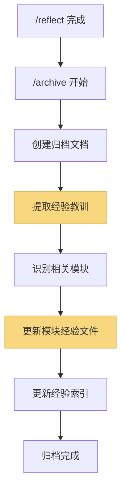

# 经验知识库系统设计

## 一、文件结构

```
memory-bank/
├── lessons/                          # 经验知识库目录
│   ├── _index.md                     # 经验索引（按模块分类）
│   ├── [module-name].md              # 按模块组织的经验文件
│   └── _extraction-rules.md          # 经验提取规则（可选）
├── reflection/                       # 现有反思文档
└── archive/                          # 现有归档文档
```

## 二、经验文件格式（精简版）

### `memory-bank/lessons/[module-name].md`

```markdown
# Module: [模块名称]

**Last Updated**: YYYY-MM-DD
**Total Lessons**: N

---

## L001: [简要标题]

**Context**: 在实现用户认证功能时遇到的会话管理问题
**Challenge**: Token过期处理导致用户体验差
**Best Practice**:
- 使用 refresh token 机制
- 在 token 过期前 5 分钟自动刷新
- 提供静默刷新，避免用户感知

**Code Pattern**:
```typescript
// 推荐模式
const refreshBeforeExpiry = (expiresIn: number) => expiresIn - 300;
```

**Related**: [Task-2023-11-15], [auth-module]
**Tags**: #authentication #token-management

---

## L002: [下一条经验]
...
```

### `memory-bank/lessons/_index.md`

```markdown
# 经验知识库索引

**Last Updated**: YYYY-MM-DD
**Total Modules**: N
**Total Lessons**: M

## 按模块分类

### 🔐 Authentication & Authorization
- [authentication.md](authentication.md) - 8 lessons
- [authorization.md](authorization.md) - 5 lessons

### 🗄️ Database & Storage
- [database-migration.md](database-migration.md) - 12 lessons
- [data-modeling.md](data-modeling.md) - 7 lessons

### 🎨 Frontend & UI
- [component-design.md](component-design.md) - 15 lessons
- [state-management.md](state-management.md) - 10 lessons

### 🔧 Infrastructure & DevOps
- [deployment.md](deployment.md) - 6 lessons
- [monitoring.md](monitoring.md) - 4 lessons

## 按标签分类

### #performance
- [database-migration.md#L003]
- [component-design.md#L007]
- [state-management.md#L002]

### #security
- [authentication.md#L001]
- [authorization.md#L003]

## 最近更新

1. [2024-01-15] authentication.md - Added token refresh pattern
2. [2024-01-14] component-design.md - React Server Components best practices
3. [2024-01-10] database-migration.md - Zero-downtime migration strategy
```

## 三、工作流程集成

### 方案 A：扩展 `/archive` 命令（推荐）

在归档阶段自动提取经验教训：



### 方案 B：新增 `/lessons` 命令

专门用于经验管理：

```bash
/lessons extract   # 从最近的反思文档提取经验
/lessons search    # 搜索相关经验
/lessons review    # 回顾特定模块的经验
```

## 四、经验提取规则

### 自动提取触发条件

从 `reflection-[task_id].md` 中提取以下内容：

1. **Technical Lessons** → 技术经验
   - 新的技术洞察
   - 架构模式发现
   - 性能优化经验

2. **Process Lessons** → 流程经验
   - 工作流程改进
   - 协作模式
   - 估算经验

3. **Challenges & Solutions** → 问题解决方案
   - 遇到的挑战
   - 解决方案
   - 避免的陷阱

### 模块识别策略

1. **从代码路径识别**：
   - `src/auth/**` → authentication 模块
   - `src/components/**` → component-design 模块
   - `src/database/**` → database 模块

2. **从任务描述识别**：
   - 关键词匹配（authentication, database, UI, etc.）
   - 使用 AI 分析任务内容

3. **手动标记**（可选）：
   - 在 reflection 文档中手动标记模块

### 经验精简原则

每条经验应该：
- ✅ Context 不超过 2 句话
- ✅ Best Practice 3-5 条要点
- ✅ Code Pattern 不超过 10 行
- ✅ 可选的代码示例
- ❌ 避免冗长的解释
- ❌ 避免重复常识性内容

## 五、实现计划

### 5.1 文件创建

1. 创建目录结构
2. 创建模板文件
3. 创建经验索引

### 5.2 规则文件

创建新的规则文件：
- `.cursor/rules/isolation_rules/Core/lessons-extraction.mdc`
- 更新 archive 相关规则

### 5.3 命令扩展

**选项 1：扩展 `/archive` 命令**
- 在归档流程中添加经验提取步骤
- 更新 `.cursor/commands/archive.md`

**选项 2：新增 `/lessons` 命令**
- 创建 `.cursor/commands/lessons.md`
- 实现独立的经验管理命令

### 5.4 更新文档

- 更新 README.md
- 更新相关工作流文档
- 添加使用示例

## 六、示例场景

### 场景：完成用户认证功能开发

1. **开发过程**：
   - `/van` 初始化任务
   - `/plan` 规划实现
   - `/creative` 设计 OAuth 流程
   - `/build` 实现功能
   - `/reflect` 反思遇到的问题

2. **反思内容**（reflection-auth-2024-01.md）：
   ```markdown
   ## Key Lessons Learned

   **Technical:**
   - JWT token 过期处理需要 refresh token 机制
   - 使用 HttpOnly Cookie 存储 token 更安全
   - 需要实现静默刷新避免用户中断

   **Process:**
   - OAuth 集成比预期复杂，需要更多时间测试
   ```

3. **经验提取**（自动或在归档时）：
   - 识别模块：`authentication`
   - 提取经验：
     - Token 管理最佳实践
     - Cookie 安全策略
     - OAuth 集成注意事项
   - 更新 `memory-bank/lessons/authentication.md`
   - 更新索引

4. **结果**：
   ```markdown
   # Module: Authentication

   ## L001: JWT Token 过期处理

   **Context**: 实现用户认证时的 token 生命周期管理
   **Challenge**: Token 过期导致用户频繁登录，体验差
   **Best Practice**:
   - 使用 refresh token 机制
   - 在 access token 过期前自动刷新
   - 实现静默刷新，避免用户感知中断
   - 使用 HttpOnly Cookie 存储，防止 XSS

   **Code Pattern**:
   ```typescript
   // Refresh token 5 minutes before expiry
   const shouldRefresh = (expiresAt: number) => {
     return Date.now() >= expiresAt - 5 * 60 * 1000;
   };
   ```

   **Related**: [Task-Auth-2024-01]
   **Tags**: #authentication #jwt #security
   ```

## 七、优势与价值

1. **知识积累**：项目经验不断积累，形成团队知识库
2. **快速查询**：按模块分类，需要时快速找到相关经验
3. **避免重复错误**：新功能开发前查阅相关经验
4. **最佳实践传播**：团队成员共享最佳实践
5. **精简高效**：聚焦核心要点，避免冗余

## 八、未来扩展

1. **AI 辅助搜索**：使用语义搜索找到相关经验
2. **经验评分**：根据使用频率和价值评分
3. **跨项目共享**：将通用经验提取为跨项目知识库
4. **可视化**：生成经验地图，展示模块间关系
5. **自动提醒**：开发新功能时自动提醒相关经验
